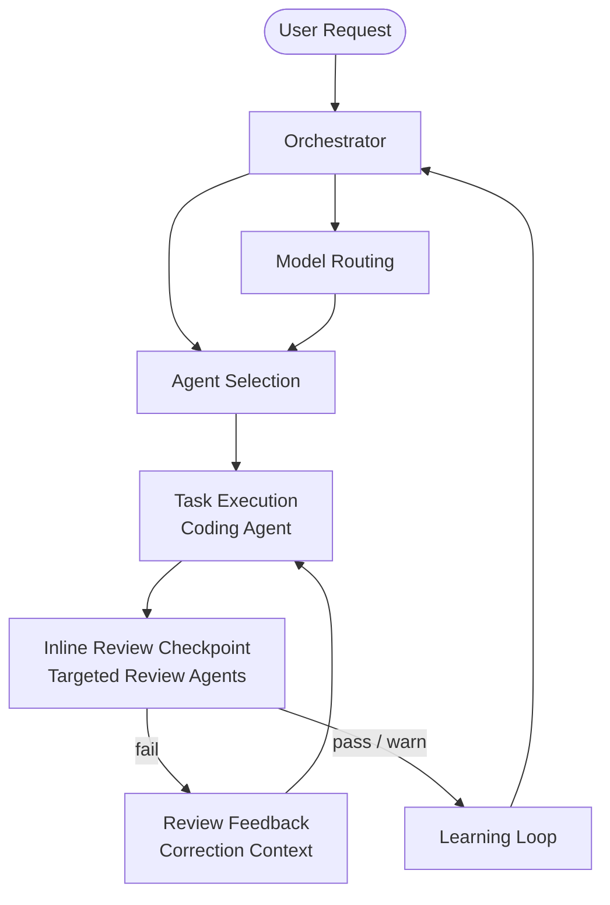

# Agentic Dev Team

A Claude Code plugin that adds a full persona-driven AI development team to any project. The Orchestrator routes tasks to specialized agents, inline review checkpoints catch quality issues during implementation, and skills provide reusable knowledge modules that any agent can draw on.



## Install

### Prerequisites

**Required:**

- [Claude Code](https://docs.anthropic.com/en/docs/claude-code) installed and authenticated
- `jq` — used by PostToolUse hooks for JSON parsing
  - macOS: `brew install jq`
  - Linux: `apt install jq` or `yum install jq`

**Recommended:**

- [Beads](https://github.com/beads-dev/beads) (`bd`) — git-backed issue tracker for AI agents. Gives agents persistent, structured task memory across sessions. Agents query `bd ready --json` at session start instead of relying on reconstructed prose context. If `bd` is not installed, agents fall back to `memory/` progress files.

  ```bash
  npm install -g @beads/bd
  # or: brew install beads
  ```

  Initialize in your project:

  ```bash
  bd init
  git add .beads && git commit -m "Initialize Beads task tracker"
  ```

**Optional:**

- `semgrep` — required only for `/semgrep-analyze`

  ```bash
  pip install semgrep
  # or: brew install semgrep
  ```

### Plugin install (recommended)

**From the Claude registry:**

```bash
# Install into the current project
claude plugin install agentic-dev-team

# Or install user-wide (available in all projects)
claude plugin install --scope user agentic-dev-team
```

**From GitHub:**

```bash
claude plugin install https://github.com/bdfinst/agentic-dev-team
claude plugin install --scope user https://github.com/bdfinst/agentic-dev-team
```

**From a local clone:**

```bash
claude plugin install --scope project /path/to/agentic-dev-team
claude plugin install --scope user /path/to/agentic-dev-team
```

After installing, run the prerequisite check:

```bash
./install.sh
```

Then add the Beads session-start hook to your global `~/.claude/CLAUDE.md`:

```markdown
## Session Start
At the beginning of every session, run `bd prime` to load Beads context before any other work.
```

### Verify

After starting Claude Code, confirm the system is working:

```
> What agents are available on this team?
```

## How It Works

**Team agents** define roles (persona, behavior, collaboration). **Review agents** check work quality in real time. **Skills** define knowledge (patterns, guidelines, procedures). **Slash commands** invoke agents and skills directly. The **Orchestrator** controls task routing, model selection, and the inline review feedback loop.

### Three-Phase Workflow

Every non-trivial task follows **Research → Plan → Implement** with human review gates between phases. During Implement, the orchestrator runs inline review checkpoints after each discrete unit of work. Review findings feed back to the coding agent (max 2 correction cycles) before escalating to human.

## Team Agents

| Agent | Purpose |
| --- | --- |
| **Orchestrator** | Routes tasks, selects models, coordinates inline review feedback loop |
| **Software Engineer** | Code generation, implementation, applies review corrections |
| **Data Scientist** | ML models, data analysis, statistical validation |
| **QA/SQA Engineer** | Testing, quality gates, peer validation |
| **UI/UX Designer** | Interface design, accessibility compliance |
| **Architect** | System design, tech decisions, scalability |
| **Product Manager** | Requirements, prioritization, stakeholder alignment |
| **Technical Writer** | Documentation, terminology consistency |
| **Security Engineer** | Security analysis, threat modeling |
| **DevOps/SRE Engineer** | Pipeline, deployment, reliability |

## Review Agents

13 specialized review agents run as sub-agents during Phase 3 checkpoints and full `/code-review` runs.

| Agent | Focus | Model |
| --- | --- | --- |
| `test-review` | Coverage gaps, assertion quality, test hygiene | sonnet |
| `security-review` | Injection, auth/authz, data exposure | opus |
| `domain-review` | Abstraction leaks, boundary violations | opus |
| `arch-review` | ADR compliance, layer violations, dependency direction | opus |
| `structure-review` | SRP, DRY, coupling, organization | sonnet |
| `complexity-review` | Function size, cyclomatic complexity, nesting | haiku |
| `naming-review` | Intent-revealing names, magic values | haiku |
| `js-fp-review` | Array mutations, impure patterns | sonnet |
| `concurrency-review` | Race conditions, async pitfalls | sonnet |
| `a11y-review` | WCAG 2.1 AA, ARIA, keyboard nav | sonnet |
| `performance-review` | Resource leaks, N+1 queries | haiku |
| `token-efficiency-review` | File size, LLM anti-patterns | haiku |
| `claude-setup-review` | CLAUDE.md completeness and accuracy | haiku |
| `doc-review` | README accuracy, API doc alignment, comment drift | sonnet |
| `svelte-review` | Svelte reactivity, closure state leaks | sonnet |

## Slash Commands

| Command | What It Does |
| --- | --- |
| `/code-review` | Run all review agents with pre-flight gates |
| `/review-agent <name>` | Run a single review agent |
| `/eval-audit` | Audit agents and commands for structural compliance |
| `/eval-runner` | Run eval fixtures and grade review agent accuracy |
| `/agent-add` | Scaffold a new review agent |
| `/agent-remove` | Remove an agent and all registry entries |
| `/apply-fixes` | Apply correction prompts from `/code-review` |
| `/review-summary` | Generate compact session summary |
| `/semgrep-analyze` | Run Semgrep SAST |

## Plugin Structure

```text
agents/                # Team agents (10) + review agents (15)
skills/                # Reusable knowledge modules (17 skills)
commands/              # Slash commands (10 commands)
hooks/                 # PreToolUse guard + PostToolUse advisory hooks
evals/                 # Review agent accuracy fixtures
docs/                  # Architecture and reference documentation
CLAUDE.md              # Orchestration pipeline configuration (auto-loaded)
install.sh             # Prerequisite check
```

---

## Local Development

### Setup

Clone the repo, then run `dev-setup.sh` to symlink root-level plugin files into `.claude/` so Claude Code can load them while you develop:

```bash
git clone <repo-url> agentic-dev-team
cd agentic-dev-team
./dev-setup.sh
```

This creates symlinks:

```
.claude/agents   -> ../agents
.claude/skills   -> ../skills
.claude/commands -> ../commands
.claude/hooks    -> ../hooks
```

To remove the symlinks:

```bash
./dev-setup.sh --clean
```

### Testing changes

**Unit testing agents and skills** — run the eval suite against a single agent or the full set:

```
/eval-runner
/eval-runner agents/naming-review.md
```

**Testing a hook change** — hooks fire automatically on every file write/edit while Claude is running in this repo. Trigger one manually to confirm behavior:

```bash
echo '{"tool_input":{"file_path":"test.js"}}' | bash hooks/js-fp-review.sh
```

**Testing in a real project** — the most reliable test is installing the plugin into a scratch project:

```bash
mkdir /tmp/plugin-test && cd /tmp/plugin-test
git init && claude
# inside claude:
# claude plugin install --scope project https://github.com/bdfinst/agentic-dev-team
```

**Running the eval audit** — verify all agents and commands meet structural compliance:

```
/eval-audit
```

### Hook paths

When running Claude Code in this repo, hooks are loaded from `hooks/` at the project root via `.claude/settings.json`. The hook path references in `settings.json` match the plugin structure (`hooks/X.sh`, not `.claude/hooks/X.sh`).

### Adding an agent or skill

```
/agent-add <description or URL to a coding standard>
```

This scaffolds the agent file, adds it to the registry in `CLAUDE.md`, and creates eval fixtures. Run `/eval-audit` and `/eval-runner` after to verify compliance.

### Documentation

| Guide | Description |
| --- | --- |
| [Getting Started](GETTING-STARTED.md) | How to invoke agents, skills, and common workflows |
| [Agents](docs/agent_info.md) | Agent roster, persona template, adding/removing agents |
| [Skills & Commands](docs/skills.md) | Skills catalog, slash commands catalog |
| [Architecture](docs/architecture.md) | Context management, quality assurance, multi-LLM routing |
| [Eval System](docs/eval-system.md) | How review agent accuracy is measured and graded |
| [C-DAD Roadmap](docs/cadad-roadmap.md) | Gaps against the Contract-Driven AI Development white paper |
